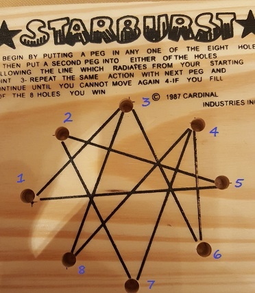

# starburst
Finding all the paths for the Starburst game board

Instructions: Place a peg on a node, follow a path to the next node, place a peg there, repeat until you run out of nodes to travel to. A solution requires you to place a peg on all eight nodes.

I realized this was related to Graph Theory, so I wrote a Depth-First Traversal recursive algorithm to find all possible paths from a given starting node. I use a stack to keep track of the path and a set to hold all unique solutions.

Here are all the possible solutions as calculated by the program:

* 1, 5, 2, 7, 4, 6, 3, 8
* 1, 5, 2, 7, 4, 8, 3, 6
* 6, 3, 1, 5, 2, 7, 4, 8
* 6, 3, 8, 4, 7, 2, 5, 1
* 6, 4, 7, 2, 5, 1, 3, 8
* 6, 4, 8, 3, 1, 5, 2, 7
* 7, 2, 5, 1, 3, 6, 4, 8
* 7, 2, 5, 1, 3, 8, 4, 6
* 8, 3, 1, 5, 2, 7, 4, 6
* 8, 3, 6, 4, 7, 2, 5, 1 
* 8, 4, 6, 3, 1, 5, 2, 7
* 8, 4, 7, 2, 5, 1, 3, 6